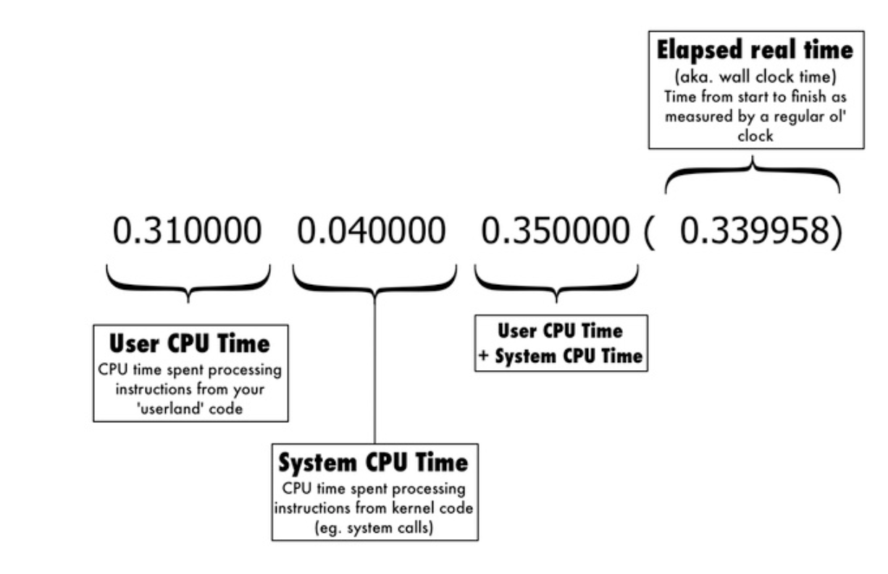
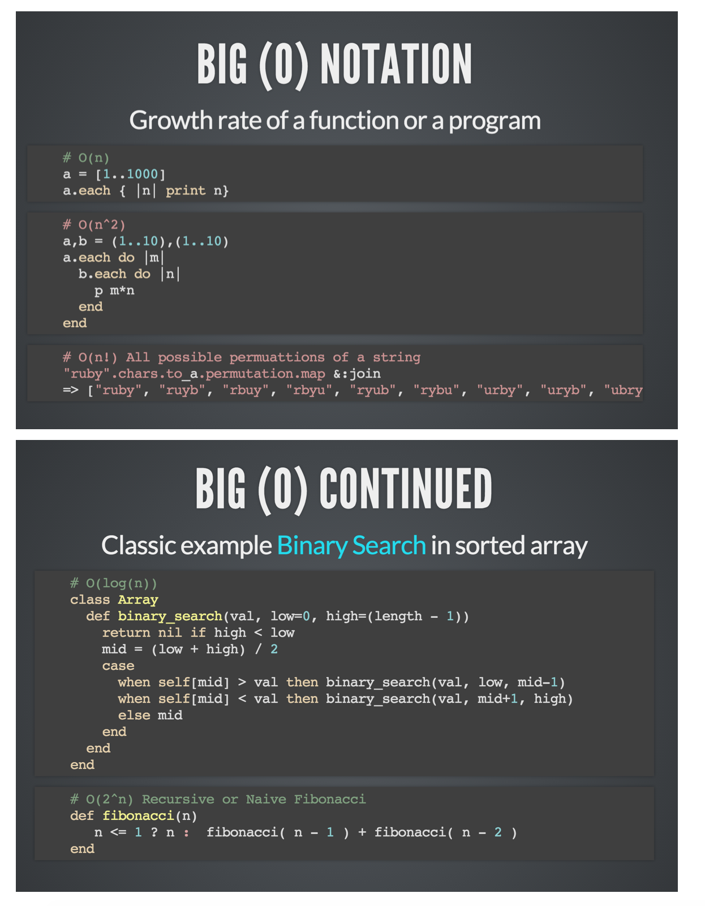

# Note To Self - Web Development Cheatsheet

## Table of Contents
  - [Git Steps & Commands](#Git Steps & Commands)
  - [My GIT Workflow](#my-git-workflow)
  - [Ruby Commands](#ruby-commands)
  - [Benchmarking](#benchmarking)
  -  [Big O - Binary Search](#big-o---binary-search)
  -  [SQLITE3 CREATE, ALTER, UPDATE METHODS](#sqlite3-create-alter-update-methods)


### GIT STEPS & COMMANDS
***

```Bash
git init
```

```ruby
git status
```
```ruby
git add
```
```
git commit . -m “Message goes here”
```

To see which remote servers you have configured, you can run the

```
git remote -v
```

command. It lists the shortnames of each remote handle you’ve specified. If you’ve cloned your repository, you should at least see origin – that is the default name Git gives to the server you cloned from:

**Create a new repo on github.com and do the following:**
```
git remote add origin https://github.com/timurcatakli/lucky_numbers.git
```
```
git push -u origin master
```
```
Delete an origin
```
```
git remote rm origin
```

**Removing or disabling GIT**
All the data git uses info is stored in .git/ , so removing it should work just fine. Of course, make sure that your working copy is in the exact state that you want it, because everything else will be lost. From there, you can run git init to create a fresh repository. 
```
rm -rf .git 
```
should suffice


### MY GIT WORKFLOW
***

CLONE THE REPO TO LOCAL HARDDRIVE
```
git clone …github.repo.url
```
MASTER is already created - create a new branch called “dev” and switch into it
```
git checkout -b “dev”
```
CONTINUE WORKING ON “DEV”, ONCE YOU MAKE A PROGRESS ADD-COMMIT

```
git add .
git commit . -m “A nice explanatory msg goes here”
```

switch to master and merge “dev” with “master

```
git checkout master
git merge dev
```

switch back to “dev” and continue working - this way you always have a working copy on master and if you make a mistake you may revert back - once you are done,  **push to origin** and **delete the branch 'dev'**


### RUBY COMMANDS
***

#### **Ruby interactive help bash terminal**
```ruby
ri -i
```
#### **Ternary Operator**

Ruby also has something called a **"ternary operator"** which provides a shortcut way of making basic comparisons. The syntax of this is a condition, followed by a question mark, followed by the expression that should be given if the condition is true, followed by a colon, followed by the expression that should be given if the condition is false, as can be seen below:

```
condition ? true_expression : false_expression
```

#### **:foo**
:foo is a **symbol** named "foo". Symbols have the distinct feature that any two symbols named the same will be identical:
```ruby
"foo".equal? "foo"  # false
```
```ruby
:foo.equal? :foo    # true
```
This makes comparing two symbols really fast (since only a pointer comparison is involved, as opposed to comparing all the characters like you would in a string), plus you won't have a zillion copies of the same symbol floating about.

***Also, unlike strings, symbols are immutable.***


### Benchmarking
***




### Big O - Binary Search
***



###SQLITE3 CREATE, ALTER, UPDATE METHODS
***

```sql
CREATE TABLE friends (
  id INTEGER,
  name STRING,
  birthday DATE);
 ```
 
```sql  
INSERT INTO friends (id, name, birthday) VALUES
(1, 'Jane Doe', 'May 19th, 1993');
```
```sql  
INSERT INTO friends (id, name, birthday) VALUES
(2, 'Joe Doe', 'May 18th, 1994');
```

```sql  
INSERT INTO friends (id, name, birthday) VALUES
(3, 'Frank Roosevelt', 'May 11th, 1995');
```

```sql  
UPDATE friends
SET name = "Jane Smith"
WHERE id = 1;
```

```sql  
ALTER TABLE friends ADD email STRING;
```

```sql  
UPDATE friends
SET email = 'jsmith@example.com'
WHERE id = 1;
```

```sql  
UPDATE friends
SET email = 'jdoe@example.com'
WHERE id = 2;
```

```sql  
UPDATE friends
SET email = 'froosevelt@example.com'
WHERE id = 3;
```

```sql  
DELETE FROM friends WHERE id = 1;
```

```sql  
SELECT * FROM friends;
```
